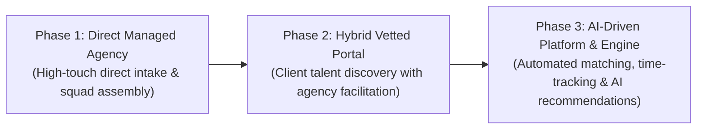
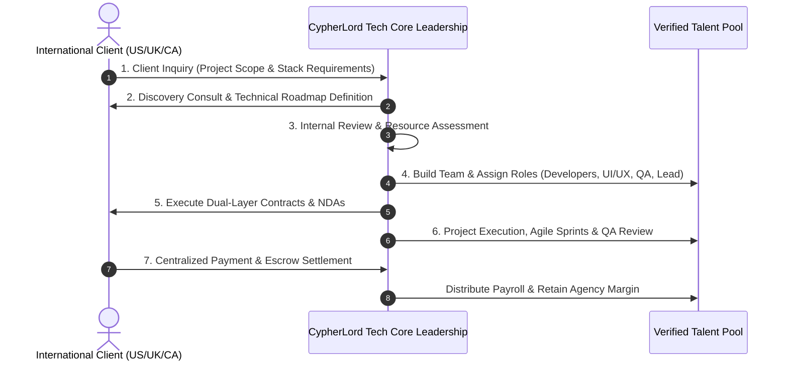
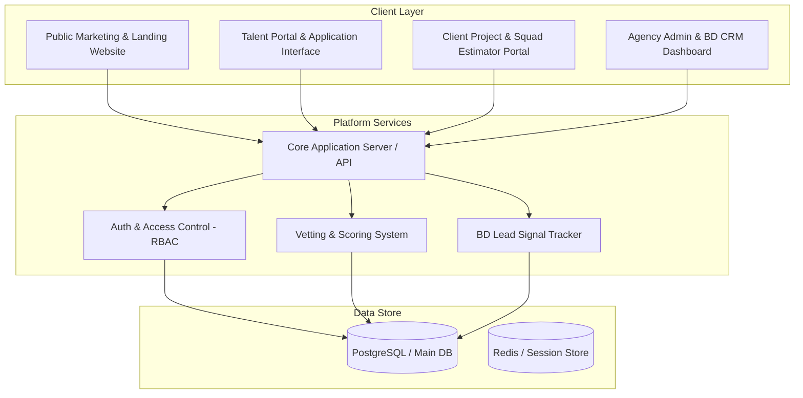

# CypherLord Tech: Comprehensive Master Blueprint & Operational Framework V2.0

## Executive Summary
**CypherLord Tech** is positioned as a premier, high-trust, agency-led technology partner. We bridge top-tier African software engineering talent with global enterprise clients across North America (US, Canada) and Europe (UK, EU). 

Moving beyond the transactional limitations and risk profiles of generic freelancer marketplaces, CypherLord Tech operates an **Agency-First Model**. We combine rigorous multi-stage talent verification, agency-level delivery guarantees, transparent financial structures, and end-to-end legal and intellectual property (IP) safeguards.

---

## 1. Strategic Brand Identity & Value Proposition

### 1.1 Core Mission & Brand Positioning
CypherLord Tech acts as a trusted, managed technology partner rather than an unvetted labor broker. Our mission is to eliminate remote hiring risk for international companies by delivering managed technical squads, senior engineering talent, and strict quality assurance.

### 1.2 Official Slogan & Symbolism
> **"Elite. Verified. Secure."**

- 💎 **Elite (Diamond Motif)**: Represents senior-level talent and high-performing technical specialists selected from the top tier of African IT professionals.
- 🛡️ **Verified (Checkmark / Shield Motif)**: Signifies our rigorous multi-stage vetting framework spanning code architecture, problem-solving, soft skills, and identity verification.
- 🔒 **Secure (Lock / Shield Motif)**: Guarantees enterprise-grade IP protection, dual-layer NDAs, legal risk mitigation, and robust financial compliance.

### 1.3 Market Differentiation Matrix
| Strategic Feature | Traditional Freelance Marketplaces (e.g. Upwork) | IT Staffing Agencies | CypherLord Tech Agency-Led Model |
| :--- | :--- | :--- | :--- |
| **Vetting Depth** | Self-reported / Basic quizzes | Resume matching | **Top 3% 5-Stage Technical & Soft-Skill Audit** |
| **Delivery Ownership** | Individual contractor | None (Placement only) | **Full Agency QA & Project Lead Oversight** |
| **Disintermediation Risk** | High platform leakage | One-time buyout | **Retained Agency Relationship & Dual NDAs** |
| **Talent Quality & Fit** | Highly variable | Variable local pools | **Pre-Vetted African IT Engineering Talent** |
| **Continuity SLA** | Re-hire if candidate leaves | Extended search time | **48-Hour Talent Replacement Guarantee** |

---

## 2. Agency Operational Model & Evolution Strategy

### 2.1 Core Operational Principles
1. **Disintermediation Protection**: All client contracts and delivery commitments reside with CypherLord Tech. Clients contract directly with the agency, guaranteeing long-term account retention and protection against platform bypass.
2. **Quality Assurance Guarantee**: Senior CypherLord Tech Tech Leads review code bases and milestone deliverables prior to client handoff.
3. **Single Point of Accountability**: Clients interface with a dedicated Project Manager or Tech Lead, eliminating communication friction and fragmenting oversight across multiple freelancers.

### 2.2 Phased Strategic Evolution


- **Phase 1 (Direct Managed Agency - Current)**: Manual lead qualification, high-touch client discovery, managed internal talent matching, and agency-driven project delivery.
- **Phase 2 (Hybrid Browsing & Portal - Near-Term)**: Clients gain secure portal access to browse anonymized, pre-vetted talent profiles and assemble custom squad requests, with engagement facilitated by agency leads.
- **Phase 3 (AI Matching & Platform Ecosystem - Scale)**: Intelligent AI matching engine connects project requirements with optimal talent based on stack alignment, timezone overlap, past performance ratings, and availability.

---

## 3. The 7-Step Agency Workflow



1. **Client Inquiry**: Inbound or outbound lead submission detailing company background, technical stack requirements, project scope, budget, and desired timelines.
2. **Discovery Consult**: Technical consultation to synthesize scope, evaluate architecture, set SLAs, and establish milestone delivery roadmaps.
3. **Internal Review**: Senior leadership assesses internal talent availability and stack alignment, determining core team vs. specialist talent requirements.
4. **Team Building & Allocation**: Assembly of specialized engineering squads (e.g., 2 Senior Backend Engineers, 1 Frontend Engineer, 1 UI/UX Designer, 1 QA Automation Engineer, 1 Tech Lead).
5. **Contracting & Compliance**: Execution of Master Services Agreement (MSA) and Statement of Work (SOW) with client; execution of binding NDAs and Contractor Agreements with talent.
6. **Project Execution & QA**: Agile sprint execution, daily standups, weekly progress demos to clients, continuous code integration, and peer QA sign-off.
7. **Payment & Distribution**: Client settles single agency invoice. CypherLord Tech manages talent payroll disbursements while retaining agency gross margins.

---

## 4. Internal Talent Dashboard & Vetting Framework

### 4.1 5-Stage Vetting Pipeline
To uphold the "Top 3% / Elite" brand standard, all network candidates undergo a strict 5-stage verification funnel:

```
┌────────────────────────────────┐
│ Stage 1: Resume & GitHub Audit │ (Screening for experience & public code)
└───────────────┬────────────────┘
                ▼
┌────────────────────────────────┐
│ Stage 2: Automated Code Test   │ (Timed DSA & Stack-specific assessment)
└───────────────┬────────────────┘
                ▼
┌────────────────────────────────┐
│ Stage 3: Live Tech Architecture│ (60-min live pair-programming & system design)
└───────────────┬────────────────┘
                ▼
┌────────────────────────────────┐
│ Stage 4: Soft Skill & English  │ (Communication, timezone overlap & culture)
└───────────────┬────────────────┘
                ▼
┌────────────────────────────────┐
│ Stage 5: Identity & Verification│ (Background check, reference verification, NDA)
└────────────────────────────────┘
```

### 4.2 Comprehensive Talent Data Specifications
| Field Name | Data Type | Description |
| :--- | :--- | :--- |
| `Talent ID` | String / UUID | Unique anonymized identifier for client display |
| `Full Name & Contact` | Confidential | Internal verification details (hidden from public view) |
| `Technical Stack` | Array[String] | Core skills (e.g. React, Node.js, Python, PostgreSQL, AWS, Docker) |
| `Seniority Tier` | Enum | Mid-Level, Senior, Tech Lead, Elite Specialist |
| `Years of Experience` | Number | Verified years in commercial software development |
| `Certifications` | Array[String] | Validated cloud/tech certifications (AWS, Azure, GCP, Kubernetes) |
| `Timezone Overlap` | String | Working hours overlap with EST, PST, GMT, BST |
| `Availability Status` | Enum | Available Immediately, 2-Weeks Notice, Fully Allocated |
| `Expected Rate ($/hr)` | Currency | Internal payout rate agreed upon with talent |
| `Billable Client Rate` | Currency | Standard agency billing rate to clients |
| `Overall Vetting Score` | Number (0-100) | Weighted average across coding, architecture, and soft skills |
| `Verification Status` | Enum | Applied, Screening, Assessment, Interviewed, Verified |

---

## 5. Strategic Lead Generation & BD Outbound Engine

### 5.1 Intent Signal Detection
Job boards (LinkedIn, Indeed, Google Jobs, AngelList/Wellfound) serve as high-intent lead indicators rather than mere recruiting feeds:
- **Urgent Role Signals**: Companies posting multi-openings for Senior Engineers (e.g. Senior DevOps, Lead Full Stack) in US/UK/CA have immediate capacity bottlenecks.
- **Remote-First Targeting**: Focus outreach on companies listing "Remote Worldwide" or "Distributed Team" openings.
- **Recruitment Firm Partnerships**: Partner with overwhelmed international tech recruiting agencies to supply pre-vetted software engineering squads.

### 5.2 Outbound Consultative Pitch Template
```text
Subject: Scalable Vetted Engineering Squad for [Company Name] / [Job Role]

Hi [Contact Name],

I noticed [Company Name] is currently expanding your engineering team and hiring for a [Job Role]. In the current market, sourcing senior technical talent with verified delivery capabilities can slow down key product roadmap milestones.

CypherLord Tech provides a high-trust, managed alternative: a vetted network of elite African software engineers and dedicated technical squads. We handle the entire vetting pipeline, technical management overhead, and delivery QA—allowing you to scale your engineering output without friction.

Key Guarantees:
• Top 3% Vetted Talent (Code Architecture, DSA, Soft Skills & Security audited)
• 48-Hour Talent Replacement SLA
• Dual-Layer NDAs & 100% Client IP Ownership
• Full Timezone Overlap with EST / PST / GMT

Would you be open to a brief 10-minute introductory call this week to see how our "Verified" model can support your immediate team capacity?

Best regards,
{Your Name}
CypherLord Tech | Elite. Verified. Secure.
```

---

## 6. Financial Architecture & Pricing Models

### 6.1 Commercial Revenue Structures
1. **Dedicated Managed Squads (Monthly Retainer)**: Fixed monthly retainer for dedicated engineering teams (e.g. $12,000 - $25,000/month per squad).
2. **Time & Materials (T&M)**: Hourly billing based on verified tracked hours ($45 - $85/hr billable depending on role seniority).
3. **Fixed-Price Milestone Projects**: Scope-defined project billing tied to milestone delivery acceptance.

### 6.2 Revenue & Margin Allocation
```
┌─────────────────────────────────────────────────────────┐
│ Client Billable Fee (100%)                              │
├───────────────────────────────┬─────────────────────────┤
│ Talent Compensation (60%-65%) │ Agency Margin (35%-40%) │
└───────────────────────────────┴─────────────────────────┘
                                  │
                                  ├─ Project Management & QA Lead (15%)
                                  ├─ Sales & Operations (10%)
                                  └─ Net Agency Margin (10%-15%)
```

---

## 7. Target Platform System Architecture & Web Application Plan

### 7.1 Platform Architecture Overview


---

## 8. Tactical Implementation Roadmap

| Module | Core Features | Purpose |
| :--- | :--- | :--- |
| **Module 1: Public Agency Web App** | Modern responsive design, Brand identity, Service pillars, Discovery booking | High-converting client acquisition front |
| **Module 2: Internal Talent Management** | Talent database, 5-stage vetting pipeline, filtering, scorecards | Internal operation & resource tracking |
| **Module 3: Lead Gen & BD CRM Tracker** | Signal monitoring, outreach pipeline, lead status, follow-up log | Predictable sales pipeline management |
| **Module 4: Client Squad & Rate Calculator** | Interactive team composition builder, real-time rate estimator, inquiry submission | High-intent client conversion tool |

---
*Blueprint Version 2.0 — Standard Operating Procedure & Architecture for CypherLord Tech.*
